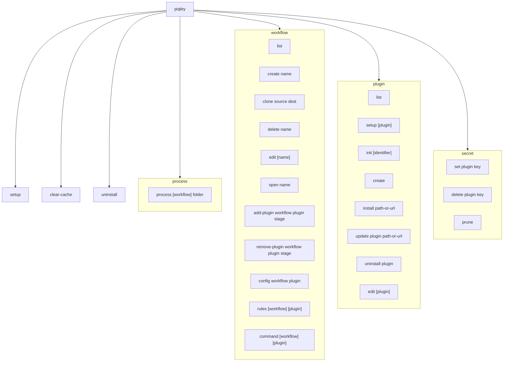
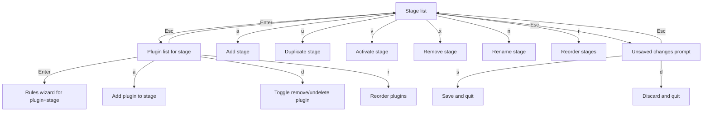
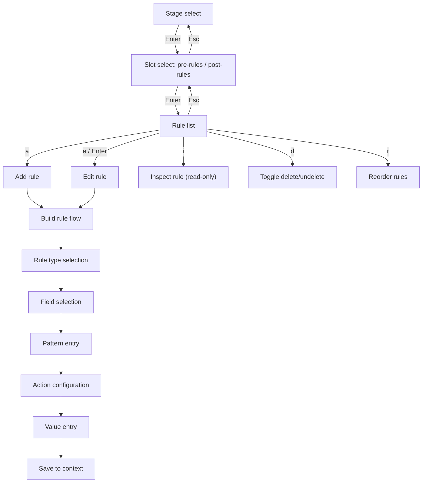

# CLI commands and wizard system

piqley uses Swift ArgumentParser for its CLI. Commands are organized into groups with subcommands. The top-level `Piqley` struct registers all command groups, and each group contains its own set of subcommands.

## Command tree

## Process command

The `process` command is the main entry point for running a workflow against a folder of photos. It loads a workflow, builds a pipeline orchestrator, and executes each stage in order.

### Arguments

`piqley process` accepts either one or two positional arguments:

| Usage | Description |
|---|---|
| `piqley process <folder>` | Uses the sole workflow when only one exists |
| `piqley process <workflow> <folder>` | Specifies which workflow to use |

When only one argument is given, piqley checks if it matches a workflow name. If it does but no folder path follows, it reports an error. If it does not match a workflow name and exactly one workflow exists, that workflow is used automatically. If multiple workflows exist and no workflow name is given, piqley lists them and asks you to specify one.

### Flags

| Flag | Description |
|---|---|
| `--dry-run` | Preview without uploading or modifying anything |
| `--debug` | Enable debug output from plugins |
| `--delete-source-contents` | Delete the contents of the source folder after a successful run |
| `--delete-source-folder` | Delete the source folder and its contents after a successful run |
| `--overwrite-source` | Overwrite source images with processed versions after a successful run |
| `--non-interactive` | Skip interactive prompts; drop invalid rules with warnings |

The process command also acquires a file lock at `~/.config/piqley/piqley.lock` to prevent concurrent runs.

## Workflow commands

The `workflow` group manages workflows: creating, editing, cloning, and configuring plugin pipelines.

| Command | Description |
|---|---|
| `workflow list` | List all workflows with plugin and stage counts |
| `workflow create [name]` | Create a new workflow, then open the config wizard |
| `workflow clone <source> <dest>` | Clone an existing workflow to a new name |
| `workflow delete <name>` | Delete a workflow (with confirmation, or `--force` to skip) |
| `workflow edit [name]` | Open the interactive config wizard for a workflow |
| `workflow open <name>` | Open a workflow JSON file in your `$EDITOR` |
| `workflow add-plugin <workflow> <plugin> <stage>` | Add a plugin to a workflow stage, with optional `--position` |
| `workflow remove-plugin <workflow> <plugin> <stage>` | Remove a plugin from a workflow stage |
| `workflow config <workflow> <plugin>` | Set per-plugin config overrides (interactive or via `--set` / `--set-secret` flags) |
| `workflow rules [workflow] [plugin]` | Open the rules wizard for a plugin within a workflow |
| `workflow command [workflow] [plugin]` | Edit binary command configuration for a plugin's stages |

The `rules` and `command` subcommands use a flexible argument resolver. If you provide a single argument, piqley treats it as a plugin identifier and infers the workflow (when only one exists). With two arguments, the first is the workflow name and the second is the plugin identifier.

## Plugin commands

The `plugin` group manages the installed plugin catalog.

| Command | Description |
|---|---|
| `plugin list` | List all installed plugins with version, description, and workflow membership |
| `plugin setup [plugin]` | Run interactive setup for one or all plugins (use `--force` to re-setup) |
| `plugin init [identifier]` | Create a new user-editable plugin with declarative rules (no binary); type is set to `.mutable` |
| `plugin create` | Create a new executable plugin from a template |
| `plugin install <path-or-url>` | Install a plugin from a local path or remote URL |
| `plugin update <plugin> <path-or-url>` | Update an installed plugin from a new path or URL |
| `plugin uninstall <plugin>` | Remove a plugin from the plugins directory |
| `plugin edit [plugin]` | Edit mutable plugin rules directly (outside any workflow) |

The `plugin init` command supports `--non-interactive` mode for scripting. It sanitizes the identifier (lowercases, strips invalid characters) and validates against reserved names like `original` and `skip`. By default it generates example stage files with sample rules. Pass `--no-examples` to skip them.

## Secret commands

The `secret` group manages plugin secrets. On macOS, secrets are stored in the Keychain. On other platforms, they are stored in `~/.config/piqley/secrets.json`.

| Command | Description |
|---|---|
| `secret set <plugin> <key>` | Store a secret (prompts for the value) |
| `secret delete <plugin> <key>` | Remove a secret |
| `secret prune` | Remove orphaned secrets not referenced by any config or workflow |

## Utility commands

| Command | Description |
|---|---|
| `setup` | First-run setup: installs bundled plugins, seeds a default workflow, opens the config wizard, then runs plugin setup scanners |
| `clear-cache` | Clear plugin execution logs (all plugins, or a specific one with `--plugin`) |
| `uninstall` | Remove all piqley configs, plugins, and stored secrets (with confirmation, or `--force` to skip) |

## Wizard system

piqley's interactive editing uses a TUI wizard architecture built on raw terminal mode. There are no external TUI framework dependencies. The wizards use ANSI escape sequences for cursor positioning, colors, and screen management.

### Core components

**`RawTerminal`** manages the terminal lifecycle. On initialization it:

1. Saves the current `termios` settings
2. Enters raw mode by disabling `ECHO`, `ICANON`, and `ISIG`
3. Switches to the alternate screen buffer (`\e[?1049h`)
4. Hides the cursor (`\e[?25l`)

On restore (or deinit), it reverses everything: shows the cursor, exits the alternate screen buffer, and restores the original `termios` settings. This means the user's scrollback and terminal state are preserved across wizard sessions.

`RawTerminal` also provides reusable TUI primitives:

- `drawScreen(title:items:cursor:footer:)` renders a scrollable selection list with highlighted cursor
- `selectFromList(title:items:)` presents a simple pick-one list
- `selectFromFilterableList(title:items:)` adds type-to-filter on top of the list
- `selectFromListWithDivider(title:items:dividerIndex:)` renders a list with an active/inactive separator
- `promptForInput(title:hint:)` collects freeform text with cursor movement
- `promptWithAutocomplete(title:hint:completions:)` adds Tab-completion and arrow key browsing to text input

**`ANSI`** is a utility enum providing escape sequence helpers: `moveTo(row:col:)`, `clearScreen()`, `clearLine()`, plus constants for `bold`, `dim`, `italic`, `inverse`, `reset`, and named colors. It also provides `terminalSize()` (via `ioctl` / `TIOCGWINSZ`) and `truncate(_:maxWidth:)` which truncates visible characters while preserving ANSI escape sequences.

**`Key`** is an enum representing parsed keypresses: `.char(Character)`, `.enter`, `.escape`, `.backspace`, `.tab`, `.cursorUp`, `.cursorDown`, `.cursorLeft`, `.cursorRight`, `.pageUp`, `.pageDown`, `.ctrlC`, `.ctrlL`, `.timeout`, and `.unknown`. The `readKey()` method on `RawTerminal` reads raw bytes and decodes escape sequences (with a 50ms timeout to distinguish bare Escape from multi-byte sequences).

### ConfigWizard navigation

The `ConfigWizard` is launched from `workflow edit` and `setup`. It provides a multi-level navigation for managing a workflow's pipeline.

The plugin list shows active plugins for the selected stage. Below a divider, it shows inactive plugins (installed but not in this stage's pipeline). You can activate an inactive plugin by pressing Enter or `a` on it.

Plugins marked for removal appear struck-through. Removals are not applied until you save. The `d` key toggles between remove and undelete.

### RulesWizard navigation

The `RulesWizard` is launched from `workflow rules`, `plugin edit`, or by pressing Enter on a plugin in the ConfigWizard. It edits the declarative rules for a specific plugin.

The rule types available when adding a new rule are:

| Rule type | Description |
|---|---|
| add | Unconditionally emit values to a field |
| add (when matching) | Emit values when a field matches a pattern |
| replace | Replace matching values with new ones |
| remove from | Remove specific values from a field |
| remove field | Remove an entire field when matched |
| clone | Unconditionally copy a field's values |
| clone (when matching) | Copy a field's values when a pattern matches |
| skip (when matching) | Skip the image when a pattern matches |

Field selection uses autocomplete with `Tab` cycling and arrow key browsing. Available fields come from upstream plugins' declared fields and the current plugin's own fields, discovered via `FieldDiscovery`. You can also press `Ctrl+L` to browse the full field list.

Patterns support three formats: plain text for exact matching, `glob:` prefix for glob patterns, and `regex:` prefix for regular expressions.

## Interactive vs. non-interactive mode

The `--non-interactive` flag on the `process` command skips all interactive prompts during pipeline execution. When a rule references a field or value that cannot be resolved, the rule is silently dropped with a warning logged to stderr. This makes piqley suitable for CI pipelines and scripted automation where no TTY is available.

The `plugin init` command also supports `--non-interactive` mode, requiring the identifier as an argument and skipping the description editor prompt.

## Setup flow

Running `piqley setup` performs the complete first-run initialization:

1. **Install bundled plugins.** Copies plugins from the `lib/piqley/plugins/` directory adjacent to the binary into `~/.config/piqley/plugins/`. Skips plugins already installed.
2. **Seed default workflow.** Creates the workflows directory and a "default" workflow if none exist. The workflow is seeded with the active stages from the stage registry.
3. **Prompt for workflow name.** Defaults to "default". Loads or creates the named workflow.
4. **Open the config wizard.** Drops into the interactive `ConfigWizard` so you can configure the pipeline.
5. **Run plugin setup scanners.** Walks through each installed plugin's manifest config entries, prompting for values and secrets that have not been configured yet.

---

[Architecture overview](overview.md) | [Configuration and workflows](config-and-workflows.md) | [Rules and state](rules-and-state.md)
