# Configuration and workflows

piqley uses a layered configuration system. Plugin defaults are overridden by base config, which is overridden by workflow-scoped config. This layering lets you set sensible defaults once and then tweak them per workflow without duplicating everything.

## Config resolution

When a plugin runs, `ConfigResolver` merges three layers of configuration into a single `ResolvedPluginConfig`. The result is injected into the plugin process as environment variables.



Each layer works as follows:

1. **Plugin manifest defaults.** The plugin's `manifest.json` declares `ConfigEntry` items. These are either `.value` entries (with a key, type, and default value) or `.secret` entries (with a `secret_key` and type). They form the baseline.
2. **Base plugin config.** Stored at `~/.config/piqley/config/<plugin>.json`, this is the user's global override for a plugin. It contains `values` (a `[String: JSONValue]` map) and `secrets` (a `[String: String]` map of key to alias).
3. **Workflow-scoped overrides.** The `config` section of `workflow.json` holds per-plugin `WorkflowPluginConfig` entries. These are optional overlays: only the keys you specify get overridden.

Merging uses `BasePluginConfig.merging(_:)`, which applies workflow overrides on top of the base config with last-writer-wins semantics per key.

### Environment variable formatting

Config keys are sanitized before injection. `ResolvedPluginConfig.sanitizeKey(_:)` uppercases the key, replaces hyphens and dots with underscores, and strips any remaining non-alphanumeric characters.

| Source | Env var prefix | Example |
|---|---|---|
| Config value | `PIQLEY_CONFIG_` | `output-dir` becomes `PIQLEY_CONFIG_OUTPUT_DIR` |
| Secret | `PIQLEY_SECRET_` | `api-key` becomes `PIQLEY_SECRET_API_KEY` |

Array values are comma-joined. Object values are encoded as `key=value` pairs joined by commas.

## Workflow model

A `Workflow` represents a named processing pipeline with per-plugin configuration overrides.

| Field | Type | Description |
|---|---|---|
| `name` | `String` | URL-safe identifier, used as the directory name |
| `displayName` | `String` | Human-readable label |
| `description` | `String` | Short summary of the workflow's purpose |
| `schemaVersion` | `Int` | Defaults to `1` |
| `pipeline` | `[String: [String]]` | Hook name to ordered plugin identifier list |
| `config` | `[String: WorkflowPluginConfig]` | Per-plugin config and secret overrides |

The `pipeline` dictionary maps stage names (hook names) to ordered lists of plugin identifiers. When you create a new workflow with `Workflow.empty(name:displayName:description:activeStages:)`, every active stage gets initialized to an empty array.



### WorkflowPluginConfig

Each entry in the workflow's `config` map is a `WorkflowPluginConfig`:

| Field | Type | Description |
|---|---|---|
| `values` | `[String: JSONValue]?` | Optional value overrides |
| `secrets` | `[String: String]?` | Optional secret alias overrides |

Both fields are optional. If `nil`, the base config value is kept as-is.

## WorkflowStore

`WorkflowStore` handles file-based persistence for workflows. Each workflow lives in its own directory under `~/.config/piqley/workflows/<name>/`.

### Directory layout

```
~/.config/piqley/workflows/
  default/
    workflow.json
    rules/
      com.piqley.ghost/
        stage-pre-process.json
        stage-publish.json
      com.piqley.watermark/
        stage-post-process.json
```

### Methods

| Method | Description |
|---|---|
| `load(name:)` | Reads and decodes `workflow.json` |
| `save(_:)` | Encodes and writes `workflow.json`, creating the directory if needed |
| `list()` | Returns sorted names of all directories containing a `workflow.json` |
| `clone(source:destination:)` | Deep-copies the entire workflow directory (including `rules/`), then updates the name |
| `delete(name:)` | Removes the workflow directory |
| `exists(name:)` | Checks whether the workflow directory exists |
| `seedDefault(activeStages:)` | Creates a "default" workflow if none exist |

### Rule seeding and scanning

When you add a plugin to a workflow, `seedRules(workflowName:pluginIdentifier:pluginDirectory:)` copies the plugin's built-in `stage-*.json` files into the workflow's `rules/<plugin>/` directory. If the directory already exists, seeding is skipped to preserve customizations.

`scanAndRegisterStages(workflowName:registry:)` walks a workflow's `rules/` tree, extracts stage names from filenames matching the `stage-*.json` pattern, and auto-registers any unknown names into the stage registry. This ensures that custom stages introduced by plugins are recognized without manual registration.

`removePluginRules(workflowName:pluginIdentifier:)` deletes the entire rules directory for a plugin when it is removed from a workflow.

## Secret management

Secrets are stored separately from config files and resolved at pipeline execution time.

### SecretStore protocol

The `SecretStore` protocol defines four operations:

| Method | Description |
|---|---|
| `get(key:)` | Retrieves a secret value by key |
| `set(key:value:)` | Stores or updates a secret |
| `delete(key:)` | Removes a secret |
| `list()` | Returns all stored secret keys |

Plugin-scoped convenience methods namespace keys as `piqley.plugins.<plugin>.<key>` via `SecretNamespace.pluginKey(plugin:key:)`.

### Platform implementations

| Platform | Implementation | Storage |
|---|---|---|
| macOS | `KeychainSecretStore` | macOS Keychain (service: `piqley`) |
| Other | `FileSecretStore` | `~/.config/piqley/secrets.json` (mode `0600`) |

The factory function `makeDefaultSecretStore()` selects the appropriate implementation at compile time.

### Alias-based indirection

Secret entries in `BasePluginConfig` and `WorkflowPluginConfig` store aliases, not raw values. The `secrets` map is `[String: String]` where the key is the logical secret name and the value is the alias stored in the secret store. During resolution, `ConfigResolver` calls `secretStore.get(key: alias)` for each entry and injects the result as `PIQLEY_SECRET_*` environment variables.

This indirection means multiple plugins can share the same secret by pointing to the same alias, and workflow overrides can redirect a secret to a different alias without changing the stored credential.

### Secret pruning

`SecretPruner` scans all base config files and workflow files to find referenced secret aliases, then deletes any secrets in the store that are no longer referenced. This keeps the secret store clean after plugins are removed or secrets are reassigned.

## Stage registry

The `StageRegistry` lives at `~/.config/piqley/stages.json` and tracks all known pipeline stages.

### Structure

| Field | Type | Description |
|---|---|---|
| `schemaVersion` | `Int` | Always `1` |
| `active` | `[StageEntry]` | Stages included in pipeline execution, in order |
| `available` | `[StageEntry]` | Known but inactive stages |

Each `StageEntry` has a `name` and an optional `hook` field used for aliasing (see below).

### Default stages

On first load, the registry is seeded with the standard hooks in canonical order:

1. `pipeline-start`
2. `pre-process`
3. `post-process`
4. `publish`
5. `post-publish`
6. `pipeline-finished`

### Required stage protection

`pipeline-start` and `pipeline-finished` are required stages. They cannot be deactivated, removed, or renamed. `StageRegistry.isRequired(_:)` checks against `StandardHook.requiredStageNames`.

### Mutation methods

| Method | Description |
|---|---|
| `addStage(_:at:)` | Inserts a new stage into the active list at a given index |
| `activate(_:at:)` | Moves a stage from available to active at a given index |
| `deactivate(_:)` | Moves a stage from active to available (blocked for required stages) |
| `removeStage(_:)` | Deletes a stage entirely from either list (blocked for required stages) |
| `reorder(_:to:)` | Moves an active stage to a new position |
| `renameStage(_:to:)` | Renames a stage in either list (blocked for required stages) |
| `autoRegister(_:)` | Adds an unknown stage name to the available list (no-op if already known) |

### Stage name validation

Stage names must be at least 2 characters, consist of lowercase letters, digits, and hyphens, and cannot start or end with a hyphen. `StageRegistry.isValidName(_:)` enforces these rules.

### Hook aliasing

A `StageEntry` can carry an optional `hook` field that maps the stage name to a different hook name. `resolvedHook(for:)` returns the `hook` value if set, or falls back to the stage name itself. This lets you create stages like `resize-for-web` that resolve to the `post-process` hook at execution time.

## PipelineEditor

`PipelineEditor` validates add and remove operations on a workflow's pipeline before they are applied.

### Add validation

`PipelineEditor.validateAdd(pluginId:stage:workflow:discoveredPlugins:registry:)` checks:

1. The stage is known to the registry.
2. The plugin exists in the discovered plugin list.
3. The plugin has a stage file for the requested stage.
4. The plugin is not already in that stage's pipeline.

### Remove validation

`PipelineEditor.validateRemove(pluginId:stage:workflow:registry:)` checks:

1. The stage is known to the registry.
2. The plugin is currently in that stage's pipeline.

### Dependency awareness

`PipelineEditor.dependents(of:in:discoveredPlugins:)` finds plugins in the workflow that declare a dependency on a given plugin. This is used to warn before removing a plugin that other plugins depend on.

---

[Architecture overview](overview.md) | [Pipeline execution](pipeline.md) | [Plugin system](plugin-system.md) | [File layout](file-layout.md)
