# Architecture overview

Piqley is a plugin-driven photographer workflow engine. It processes batches of images through a configurable pipeline of stages, where plugins perform work (tagging, resizing, publishing) and declarative rules transform metadata between stages. The system is split across three repositories that form a layered dependency chain.

## System layers

| Layer | Repository | Key types |
|-------|-----------|-----------|
| **CLI** | piqley-cli | Pipeline orchestrator, plugin discovery, rule evaluator, state store, TUI wizards, CLI commands |
| **SDK** | piqley-plugin-sdk | `PiqleyPlugin` protocol, `HookRegistry`, `PluginRequest`/`PluginResponse`, `PluginState`/`ResolvedState`, packager |
| **Core** | piqley-core | `PluginManifest`, `Hook`/`StandardHook`, `Rule`/`EmitConfig`, `StageConfig`/`StageRegistry`, `PluginInputPayload`/`PluginOutputLine`, `JSONValue` |
| **Plugins** | external | Conforms to SDK (Swift) or raw JSON protocol (any language) |

**PiqleyCore** is the foundation library with no external dependencies. It defines the shared types that both the CLI and the SDK depend on: plugin manifests, rules, stage configs, JSON payload schemas, and validation.

**PiqleyPluginSDK** builds on PiqleyCore to provide Swift bindings for plugin authors: the `PiqleyPlugin` protocol, hook registration, typed state access, and the `piqley-build` packager. Plugins written in other languages can skip the SDK and conform directly to the JSON stdin/stdout protocol.

**piqley-cli** is the user-facing tool. It discovers plugins, orchestrates the pipeline, evaluates rules, manages workflows and config, and provides the interactive TUI wizards.

## Pipeline at a glance

Images enter at `pipeline-start` and flow through each stage in order. At every stage, the orchestrator runs each assigned plugin's **preRules**, then its **binary** (if any), then its **postRules**. Rules read and transform metadata in the state store; binaries do the heavy lifting (resize, upload, tag).

The green stages (`pipeline-start`, `pipeline-finished`) are required lifecycle hooks that always run. The middle stages are the default set, but users can add, remove, rename, and reorder custom stages via the stage registry.

## Key concepts

| Concept | Definition |
|---|---|
| **Stage** | A named step in the pipeline (e.g. `pre-process`, `publish`). Each stage has slots for preRules, a binary command, and postRules. |
| **Hook** | The protocol-level name a plugin recognizes. Usually matches the stage name, but custom stages can alias to a standard hook. |
| **Plugin** | A package installed at `~/.config/piqley/plugins/<identifier>/` containing a manifest, stage configs, and optionally a binary. |
| **Rule** | A declarative match-and-action pair. Matches a metadata field pattern, then emits actions (add, remove, replace, skip, etc.) to transform state. |
| **Workflow** | A named pipeline configuration stored at `~/.config/piqley/workflows/<name>/`. Maps stages to plugin lists and holds per-plugin config overrides. |
| **Namespace** | A scoped bucket in the state store. Each plugin writes to its own namespace; `original` holds extracted image metadata. |
| **State store** | The in-memory, per-run data structure holding all metadata and plugin output, keyed by image, then namespace, then field. |

## Detailed documentation

Each subsystem has its own detailed doc:

- **[Pipeline execution](pipeline.md):** how images flow through stages, the orchestrator sequence, fork management, dry-run mode
- **[Plugin system](plugin-system.md):** plugin discovery, the communication protocol, manifest structure, the SDK, packaging
- **[Rules and state](rules-and-state.md):** the state store, rule evaluation, emit actions, templates, skip propagation
- **[Configuration and workflows](config-and-workflows.md):** config resolution, workflow model, secrets, the stage registry
- **[CLI commands](cli-commands.md):** command tree, the TUI wizard system, interactive vs non-interactive mode
- **[File layout and reference](file-layout.md):** directory structures, JSON schemas, environment variables, exit codes
