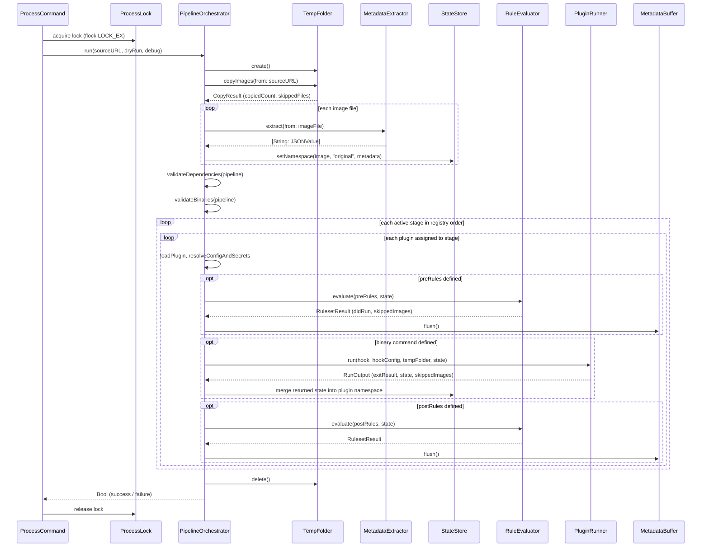
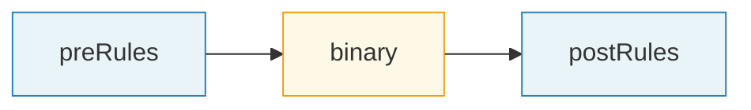

# Pipeline execution

The pipeline is the core of piqley. When you run `piqley process`, the `ProcessCommand` acquires a process lock, builds a `StageRegistry`, and hands everything to `PipelineOrchestrator.run()`. The orchestrator copies your images into a temporary folder, extracts metadata, validates plugins, then walks through each active stage in registry order, running plugin binaries sandwiched between rule evaluations. When every stage finishes (or a critical failure aborts the run), the temp folder is cleaned up and you get a success or failure result.

## Orchestration sequence

This diagram shows the full lifecycle of a single `piqley process` invocation.

## Stage hook lifecycle

Each stage has three slots that execute in sequence. A plugin does not need to use all three; any combination is valid.

**preRules** transform state before the binary sees it. Rules can set fields in the plugin's namespace, skip images, or copy values from other namespaces. After preRules evaluate, the `MetadataBuffer` flushes any pending EXIF/IPTC writes. Skipped images are physically removed from the plugin's image folder so the binary never receives them.

**binary** is the plugin's executable. It receives the image folder path, configuration, secrets, and (for the JSON protocol) the full state payload on stdin. It does its work: editing images, uploading, renaming, or whatever the plugin is built to do. Its stdout output is parsed for progress lines, image results, and a final result line.

**postRules** transform the binary's output. They run against the updated state (including any values the binary returned) and can further modify the plugin namespace. The buffer flushes again after postRules complete.

## Standard hooks

These are the six built-in stages that ship with every piqley installation. You can add custom stages between them or deactivate the optional ones, but `pipeline-start` and `pipeline-finished` are required and cannot be removed.

| Hook | Description |
|------|-------------|
| `pipeline-start` | Runs once at the beginning of a pipeline. Good for initialization, validation, or setup tasks. Required stage. |
| `pre-process` | Runs before the main processing stage. Useful for metadata enrichment, AI tagging, or watermark preparation. |
| `post-process` | The main editing stage. Plugins here typically modify images: retouching, resizing, format conversion. |
| `publish` | Distribution stage. Plugins here upload images to galleries, storage services, or delivery platforms. |
| `post-publish` | Runs after publishing. Useful for notifications, logging, analytics, or cleanup tasks. |
| `pipeline-finished` | Runs once at the end. Good for summary reports, final cleanup, or triggering downstream workflows. Required stage. |

## Image flow

When `PipelineOrchestrator.run()` starts, it creates a `TempFolder` in your system's temporary directory (named `piqley-<uuid>`) and copies all supported image files from the source folder. Hidden files (names starting with `.`) are silently excluded. Unsupported formats are logged as warnings.

### Supported formats

| Extension | Format |
|-----------|--------|
| `jpg`, `jpeg` | JPEG |
| `jxl` | JPEG XL |
| `png` | PNG |
| `tiff`, `tif` | TIFF |
| `heic`, `heif` | HEIC / HEIF |
| `webp` | WebP |

After copying, `MetadataExtractor` reads EXIF, IPTC, TIFF, GPS, and JFIF metadata from each image using Apple's `ImageIO` framework. The extracted key-value pairs are stored in the `StateStore` under the `original` namespace, using `Group:Tag` keys (for example, `EXIF:DateTimeOriginal` or `IPTC:Caption/Abstract`). Every plugin and rule in the pipeline can read from this namespace.

When the pipeline finishes, the temp folder is deleted in a `defer` block, regardless of whether the run succeeded or failed. If `--overwrite-source` was passed, processed images are copied back to the source folder before cleanup.

## Dry-run mode

The `--dry-run` flag on `piqley process` threads through the entire pipeline. `ProcessCommand` passes it to `PipelineOrchestrator.run()`, which includes it in every `HookContext`. From there:

- `PluginRunner` sets the `PIQLEY_DRY_RUN` environment variable to `1` (or `0` when not in dry-run mode).
- For JSON protocol plugins, the `dryRun` field is included in the stdin payload.
- Plugins are expected to honor this flag by skipping destructive operations (uploads, file modifications, API calls that mutate remote state).

Dry-run mode does **not** skip rule evaluation. PreRules and postRules still execute, so you can inspect how state flows through the pipeline. The only difference is that plugins receive the signal to avoid side effects.

Post-run cleanup flags (`--delete-source-contents` and `--delete-source-folder`) are also suppressed during dry runs. `ProcessCommand` checks `succeeded && !dryRun` before performing any source folder deletion.

## Process lock

Piqley enforces single-instance execution using `ProcessLock`. When `ProcessCommand` starts, it opens a lock file at `~/.config/piqley/piqley.lock` and attempts an exclusive, non-blocking `flock`. If another instance already holds the lock, the command fails immediately with an error message.

The lock is released in a `defer` block when `ProcessCommand.run()` exits. If the process crashes, the operating system automatically releases the file lock, so stale locks do not accumulate.

---

[Architecture overview](overview.md) | [Plugin system](plugin-system.md) | [Rules and state](rules-and-state.md)
