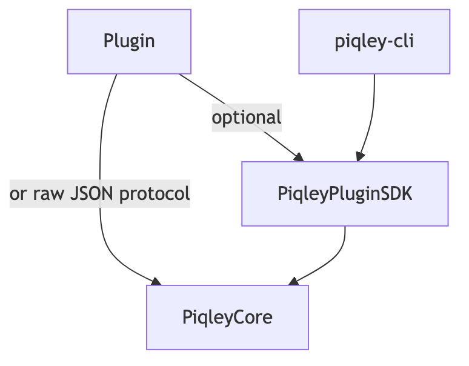
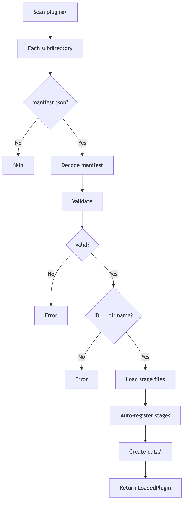
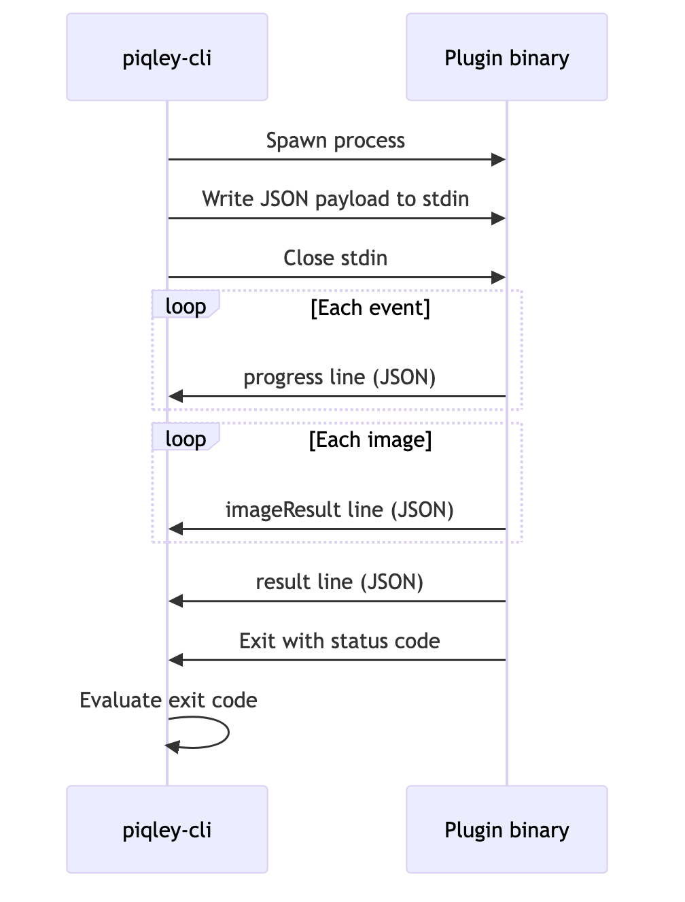

# Plugin system

Plugins are the extensibility mechanism in piqley. They let you add new stages to the pipeline, process images, modify metadata, and integrate with external services. You can write plugins as Swift packages using the PiqleyPluginSDK, or in any language that speaks the JSON stdin/stdout protocol.

## Repository structure

The plugin system spans three repositories. PiqleyCore sits at the bottom, providing shared types like `PluginManifest`, `PluginInputPayload`, and `PluginOutputLine`. The SDK depends on PiqleyCore, and the CLI depends on the SDK (getting PiqleyCore as a transitive dependency). Plugins optionally depend on the SDK for convenience, or they can implement the raw JSON protocol directly.



## Plugin types

Piqley recognizes two plugin types, declared in the manifest's `type` field. The type controls whether users can edit the plugin's built-in rules and commands directly.

**Static plugins** are immutable after install. Their built-in rules and binary commands cannot be edited by the user. This preserves the author's original defaults. When a static plugin is added to a workflow stage, its rules are copied into the workflow's rules directory. Users can then customize those workflow-scoped copies without affecting the plugin itself or other workflows that use the same plugin. This is the default type when `type` is omitted from the manifest.

**Mutable plugins** allow direct editing of the plugin's built-in rules and commands via `piqley plugin edit`. Changes to a mutable plugin affect the defaults that get copied when the plugin is added to new workflows. You create mutable plugins with `piqley plugin init`, which scaffolds the directory structure and stage files.

Both types can have binaries, rules, or both. The distinction is purely about editability of the plugin's own files, not about capability.

## Plugin discovery

When piqley starts, `PluginDiscovery` scans the plugins directory and loads every valid plugin it finds. The directory name must match the manifest's `identifier` field exactly.



Stage files follow the naming convention `stage-{hookName}.json`. When a stage file references a hook name that the registry does not already know, piqley auto-registers it. This lets plugins introduce entirely new stages without any CLI changes.

## Communication protocol

Piqley supports two protocols for running plugin hooks: JSON and pipe. The protocol is set per-hook in the stage config's `pluginProtocol` field, defaulting to `json`.

### JSON protocol

The JSON protocol is the primary communication channel. It provides full access to state, configuration, and per-image results.



### Pipe protocol

The pipe protocol is simpler. stdout and stderr pass straight through to the terminal. There is no structured output, no state return, and no per-image results. This works well for wrapping existing CLI tools that write their own output. The pipe protocol also supports a `batchProxy` mode, which runs the command once per image with per-image environment variables.

### Exit code evaluation

The `ExitCodeEvaluator` maps a process exit code to one of three results: `success`, `warning`, or `critical`. You can configure the mapping per-hook with `successCodes`, `warningCodes`, and `criticalCodes` arrays. When all three arrays are empty (the default), piqley uses Unix conventions: 0 is success, anything else is critical.

## PluginInputPayload

The JSON payload written to stdin for the JSON protocol. Defined in `PiqleyCore/Payload/PluginInputPayload.swift`.

| Field | Type | Description |
|---|---|---|
| `hook` | `String` | The hook stage being executed |
| `imageFolderPath` | `String` | Path to the image folder being processed |
| `pluginConfig` | `[String: JSONValue]` | Key-value configuration for this plugin instance |
| `secrets` | `[String: String]` | Secret values resolved from environment variables |
| `executionLogPath` | `String` | Path to the execution log file |
| `dataPath` | `String` | Path to the plugin's persistent data directory |
| `logPath` | `String` | Path to the plugin's log directory |
| `dryRun` | `Bool` | When true, skip destructive operations |
| `debug` | `Bool` | When true, emit additional diagnostic output |
| `state` | `[String: [String: [String: JSONValue]]]?` | Persisted state from previous executions, keyed by plugin namespace, then folder path, then field key |
| `pluginVersion` | `SemanticVersion` | The current version of this plugin (serialized as a `"major.minor.patch"` string in JSON) |
| `lastExecutedVersion` | `SemanticVersion?` | The last version of this plugin that ran successfully through `pipeline-start` (serialized as a string in JSON). Persisted to `version-state.json` in the plugin directory. `nil` on first run. |
| `skipped` | `[SkipRecord]` | Images that were skipped during pipeline processing |
| `pipelineRunId` | `String?` | Unique identifier for the current pipeline run |

## PluginOutputLine

Each line of stdout from a JSON-protocol plugin is a newline-delimited JSON object. Defined in `PiqleyCore/Payload/PluginOutputLine.swift`.

| Type value | Required fields | Optional fields | Purpose |
|---|---|---|---|
| `"progress"` | `type` | `message` | Emit a human-readable status update |
| `"imageResult"` | `type`, `filename` | `status`, `message`, `error` | Report the outcome of processing a single image |
| `"result"` | `type` | `success`, `error`, `state` | Final result line. Must be the last line emitted. |

The `status` field on `imageResult` lines uses the `ImageOutcome` enum: `success`, `failure`, `warning`, or `skip`. When an image has status `skip`, piqley adds it to the skipped images list and reports it in the CLI output.

## SDK abstractions

The PiqleyPluginSDK provides Swift-native abstractions over the raw JSON protocol. If you are writing a plugin in another language, you implement the protocol directly.

**`PiqleyPlugin` protocol.** Your plugin's entry point. Implement `handle(_ request:) async throws -> PluginResponse` and provide a `registry` property. The SDK's `run()` method handles stdin/stdout serialization, `--piqley-info` probing, and exit code mapping automatically.

**`HookRegistry`.** Provides type-safe hook dispatch. You register `Hook`-conforming enum types during initialization. When a payload arrives, the registry resolves the raw hook string into a typed value. The registry also drives stage file generation: `writeStageFiles(to:)` produces `stage-*.json` files from the registered hooks.

```swift
let registry = HookRegistry { r in
    r.register(StandardHook.self) { hook in
        switch hook {
        case .publish:
            return buildStage { Binary(command: "bin/my-plugin") }
        default:
            return nil
        }
    }
}
```

**`PluginRequest`.** A typed wrapper around `PluginInputPayload`. Provides `imageFiles()` to list images, `reportProgress(_:)` for progress lines, and `reportImageResult(_:outcome:message:)` for per-image results. The hook field is a typed `Hook` value rather than a raw string.

**`PluginResponse`.** A typed wrapper for the result output line. Contains `success`, `error`, and optional `state` (a dictionary of `PluginState` objects). `PluginResponse.ok` is a convenience for a successful response with no state changes.

**`PluginState` and `ResolvedState`.** `PluginState` is a builder for outgoing state: you set typed values (`String`, `Int`, `Bool`, `Double`, `[String]`, `JSONValue`) by key, and it serializes to `[String: JSONValue]`. `ResolvedState` wraps the incoming state dictionary (image name to namespace to key-value pairs) and provides subscript access.

## Manifest structure

The `manifest.json` file describes a plugin's identity, configuration, and requirements. Defined as `PluginManifest` in `PiqleyCore/Manifest/PluginManifest.swift`.

| Field | Type | Required | Description |
|---|---|---|---|
| `identifier` | `String` | Yes | Reverse-TLD identifier (e.g. `"com.piqley.ghost"`). Must match the plugin directory name. |
| `name` | `String` | Yes | Human-readable display name |
| `type` | `PluginType` | No | `"static"` or `"mutable"`. Defaults to `"static"`. |
| `description` | `String` | No | Short description of what the plugin does |
| `pluginSchemaVersion` | `String` | Yes | Must be in the set of supported versions (currently `"1"`) |
| `pluginVersion` | `SemanticVersion` | No | The plugin's own version |
| `config` | `[ConfigEntry]` | No | Configuration entries: values (key/type/default) and secrets (env var keys) |
| `setup` | `SetupConfig` | No | Setup instructions or hooks |
| `dependencies` | `[PluginDependency]` | No | Other plugins this plugin depends on |
| `supportedFormats` | `[String]` | No | Image formats this plugin can handle |
| `supportedPlatforms` | `[String]` | No | Platforms this plugin supports |
| `fields` | `[ConsumedField]` | No | State fields this plugin declares it works with |

### Validation rules

`ManifestValidator.validate()` checks the following constraints:

- `identifier` must not be empty
- `identifier` must not be a reserved name (`"original"`, `"skip"`)
- `name` must not be empty
- `pluginSchemaVersion` must not be empty
- `pluginSchemaVersion` must be in `PluginManifest.supportedSchemaVersions`

During discovery, piqley also verifies that the `identifier` matches the directory name. A mismatch produces an `identifierMismatch` error.

## Plugin packaging

The `Packager` (in PiqleyPluginSDK) assembles a `.piqleyplugin` archive from a plugin source directory. The process is driven by a `piqley-build-manifest.json` file (the `BuildManifest`).

### BuildManifest fields

| Field | Type | Description |
|---|---|---|
| `identifier` | `String` | Reverse-TLD identifier |
| `pluginName` | `String` | Name used for the archive's root directory |
| `pluginSchemaVersion` | `String` | Schema version for the generated manifest |
| `description` | `String?` | Plugin description |
| `pluginVersion` | `String?` | Semantic version string |
| `config` | `[ConfigEntry]?` | Default config entries (can be overridden by `config-entries.json`) |
| `setup` | `SetupConfig?` | Setup configuration |
| `supportedFormats` | `[String]?` | Supported image formats |
| `bin` | `[String: [String]]` | Platform-keyed binary paths (e.g. `{"macos-arm64": ["bin/my-plugin"]}`) |
| `data` | `[String: [String]]` | Platform-keyed data file paths |
| `dependencies` | `[PluginDependency]?` | Plugin dependencies |

### Archive structure

The `.piqleyplugin` archive is a zip file with this layout:

```
my-plugin/
  manifest.json          # Generated from BuildManifest
  stage-preProcess.json  # Copied from source directory
  stage-publish.json
  bin/
    macos-arm64/
      my-plugin          # Platform-specific binary
  data/
    macos-arm64/
      model.mlmodel      # Platform-specific data files
```

The packager generates `manifest.json` from the build manifest, optionally overriding config entries from a `config-entries.json` file and fields from a `fields.json` file. It verifies all declared `bin` and `data` paths exist before archiving.

## Binary probing

`BinaryProbe` determines whether a command is a PiqleyPluginSDK-based plugin or a regular CLI tool. It runs the binary with `--piqley-info` and inspects the response.

The probe returns one of four results:

- **`piqleyPlugin(schemaVersion:)`**: the binary responded with `{"piqleyPlugin": true, "schemaVersion": "..."}`. It is a native SDK plugin.
- **`cliTool`**: the binary exists and is executable, but did not respond to `--piqley-info` with valid JSON. It is a regular CLI tool.
- **`notFound`**: the resolved path does not exist.
- **`notExecutable`**: the file exists but is not executable.

The probe has a 5-second timeout. If the process does not exit within that window, it is terminated and classified as `cliTool`.

## Dependency validation

Before a pipeline runs, `DependencyValidator` checks that every plugin's declared dependencies are satisfied. It takes the list of manifests, the pipeline configuration (hook name to plugin list), and the canonical stage order.

The validator enforces two rules:

1. **Existence.** Every dependency must be present in the pipeline. The reserved name `"original"` is always considered satisfied (it refers to the original image state).
2. **Ordering.** Every dependency must run before the plugin that depends on it. This means the dependency must appear in an earlier stage, or in the same stage at an earlier position.

If validation fails, the pipeline does not start. The error message names the offending plugin and its unsatisfied dependency.

Reserved identifiers (`"original"`, `"skip"`) cannot be used as plugin identifiers. Both `ManifestValidator` and `DependencyValidator` enforce this independently.

---

[Architecture overview](overview.md) | [Pipeline execution](pipeline.md) | [Rules and state](rules-and-state.md) | [File layout](file-layout.md)
