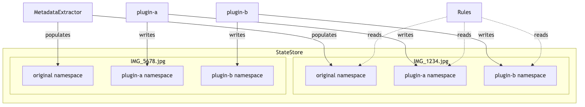
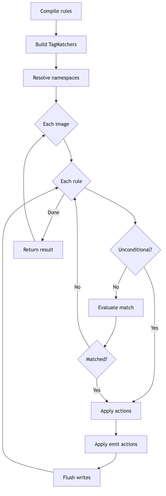

# Rules and state management

The rules engine is piqley's declarative metadata transformation system. Rules let you manipulate image metadata without writing code. You describe what to match and what to change, and piqley handles the rest: pattern compilation, namespace isolation, auto-cloning, template resolution, and writing results back to image files.

This document covers the state store that holds per-image metadata, the rule structure and evaluation lifecycle, every emit action type, and supporting mechanisms like template resolution, auto-clone, and skip propagation.

## State store

The state store is a three-level hierarchy: image filename, then namespace, then key/value pairs. Each image gets its own isolated set of namespaces, and each namespace belongs to either the `original` metadata extractor or a specific plugin.



`MetadataExtractor` reads EXIF, IPTC, TIFF, GPS, and JFIF metadata from each image file and stores it under the `original` namespace. Plugins write their output to their own namespace. Rules can read across any namespace using qualified field names in the form `namespace:field`.

## State store internals

`StateStore` is a Swift `actor`, which means all access is serialized and data-race-free without manual locking. The store is created fresh for each pipeline run.

The internal data structure is a three-level dictionary:

```
[String: [String: [String: JSONValue]]]
  ^image    ^namespace  ^field   ^value
```

Key operations:

- **`setNamespace(image:plugin:values:)`**: replaces the entire namespace for a given image and plugin. Used when a plugin returns its full output payload.
- **`mergeNamespace(image:plugin:values:)`**: merges key/value pairs into an existing namespace. New keys are added, existing keys are overwritten, and keys not present in the new values are preserved.
- **`resolve(image:dependencies:)`**: returns only the namespaces listed in `dependencies` for a given image. This is how the pipeline controls which upstream state a plugin can see.
- **`appendSkipRecord(image:record:)`**: appends a skip record to the reserved `skip` namespace under the `records` key. Skip records accumulate as an array of JSON objects.

All namespace identifiers are strings. The `ReservedName.original` constant (`"original"`) is used for the metadata extractor namespace, and `ReservedName.skip` (`"skip"`) is reserved for skip tracking.

## Rule structure

A `Rule` has three parts: an optional match condition, a list of emit actions, and an optional list of write actions.

```swift
public struct Rule: Codable, Sendable, Equatable {
    public let match: MatchConfig?
    public let emit: [EmitConfig]
    public let write: [EmitConfig]
}
```

### MatchConfig

The match block identifies which metadata field to test and what pattern to look for.

| Property  | Type     | Description |
|-----------|----------|-------------|
| `field`   | `String` | The metadata field to match against. Supports `namespace:field` qualified names. |
| `pattern` | `String` | The pattern to test. Plain string for exact match, or prefixed with `regex:` or `glob:`. |
| `not`     | `Bool?`  | When `true`, inverts the match so the rule fires on non-matching values. |

When `match` is `nil`, the rule is unconditional and always fires.

### EmitConfig

Each emit entry describes a single transformation to apply.

| Property       | Type             | Description |
|----------------|------------------|-------------|
| `action`       | `String?`        | The action type. Defaults to `"add"` when nil. |
| `field`        | `String?`        | The target field name. Use `"*"` with `removeField` or `clone` for all fields. |
| `values`       | `[String]?`      | Values for `add` and patterns for `remove`. |
| `replacements` | `[Replacement]?` | Ordered pattern/replacement pairs for `replace`. |
| `source`       | `String?`        | Source reference (`namespace:field` or namespace name) for `clone`. |
| `not`          | `Bool?`          | Inverts the action. Only valid for `remove` and `removeField`. |

Each `Replacement` contains a `pattern` (with optional `regex:` or `glob:` prefix) and a `replacement` string that supports `$1`/`$2` capture group references for regex patterns.

## Rule evaluation

When rules run, they are first compiled into `CompiledRule` structs. This precompiles regex patterns into `TagMatcher` instances and resolves namespace references. Then the evaluator walks each image, applying matching rules.



### Compilation phase

During compilation, each `Rule` becomes a `CompiledRule`:

1. The match field is split on the first `:` to extract the namespace and field name. A bare field name (no colon) is automatically scoped to the plugin's own namespace (e.g. `rating` in plugin `stars` becomes `stars:rating`).
2. The `self` namespace prefix is resolved to the actual `pluginId`.
3. Match patterns are compiled into `TagMatcher` instances (`ExactMatcher`, `GlobMatcher`, or `RegexMatcher`).
4. Emit and write configs are compiled into `EmitAction` enum values.
5. Foreign namespace references (namespaces that are not the plugin's own, not `read`, and not reserved) are collected into `referencedNamespaces` so the pipeline knows what state dependencies to resolve.

### Evaluation phase

The `evaluate()` method processes compiled rules against resolved state:

1. For each rule, determine whether it should apply. Unconditional rules always apply. Conditional rules resolve the match field from the appropriate namespace (including `read:` for file metadata) and test it against the compiled matcher, respecting the `not` flag.
2. When matching against array-valued fields, the rule matches if any element in the array satisfies the matcher.
3. Emit actions are applied in order to a mutable `working` dictionary (the plugin's namespace for that image).
4. Write actions are applied to the `MetadataBuffer`, which tracks dirty images for later flush.
5. If a `skip` action fires, evaluation stops immediately for that image.

## Emit action reference

| Action | Description | Required fields | Example before | Example after |
|--------|-------------|-----------------|----------------|---------------|
| `add` | Adds values to a field. Creates the field if absent. Deduplicates: existing values are preserved. | `field`, `values` | `Keywords: ["nature"]` | `Keywords: ["nature", "sunset"]` |
| `remove` | Removes values matching the given patterns from a field. Supports `not` to keep only matching values. | `field`, `values` (as patterns) | `Keywords: ["nature", "urban", "sunset"]` | `Keywords: ["nature", "sunset"]` (removed `"urban"`) |
| `replace` | Regex or glob find-and-replace on individual field values. Replacements are tried in order, first match wins. | `field`, `replacements` | `Keywords: ["landscape-photo"]` | `Keywords: ["landscape_image"]` |
| `removeField` | Removes an entire field from the namespace. Use `"*"` to clear all fields. Supports `not` to keep only the named field. | `field` | `{Keywords: [...], Title: "..."}` | `{Title: "..."}` (removed `Keywords`) |
| `clone` | Copies a field (or all fields with `"*"`) from another namespace into the working namespace. Merges array values, deduplicating. | `field`, `source` | working: `{}` | working: `{Keywords: ["nature"]}` (cloned from `original:Keywords`) |
| `skip` | Marks the image as skipped for downstream plugins. Must be the only emit action. Cannot have write actions. | none | image is active | image is skipped, removed from working folder |
| `writeBack` | Triggers writing the current file metadata buffer to disk. Must appear in `write[]`, not `emit[]`. Must be the only write action. | none | metadata in buffer | metadata written to image file |

> **Linux:** The `writeBack` action and all metadata write operations require `ImageIO` (macOS/Apple platforms only). On Linux, `MetadataWriter` is a no-op that logs a warning. Rules that use `writeBack` will still evaluate without error, but no changes will be written to the image files. Similarly, the `read:` namespace (which reads live file metadata) returns empty results on Linux.

## Rule slots

Each stage configuration (`StageConfig`) has two rule slots surrounding the binary execution:

- **`preRules`**: evaluated before the binary runs. Use these to prepare the plugin's namespace, clone fields from upstream plugins, add computed tags, or skip images before the binary processes them.
- **`postRules`**: evaluated after the binary runs. Use these to transform the plugin's output, clean up unwanted fields, or write metadata back to image files.

Both slots accept the same `[Rule]` array and support the same actions. The key difference is timing: `preRules` can influence what the binary sees (since the binary receives the plugin's namespace as input), while `postRules` operate on what the binary produced.

A stage with no binary can still have rules. In that case, `preRules` and `postRules` are functionally equivalent, but the naming still communicates intent to anyone reading the config.

## Pattern matching

Match patterns and remove/replace patterns support three formats:

| Format | Prefix | Behavior | Example |
|--------|--------|----------|---------|
| Exact | (none) | Case-insensitive exact string match | `"landscape"` |
| Regex | `regex:` | Full regex, case-insensitive, whole-string match | `"regex:land.*"` |
| Glob | `glob:` | Shell-style glob via `fnmatch`, case-insensitive | `"glob:*scape*"` |

These prefixes are defined as constants in `PatternPrefix.regex` and `PatternPrefix.glob`.

At compile time, each pattern string is passed through `TagMatcherFactory.build(from:)`, which returns the appropriate `TagMatcher` implementation:

- `ExactMatcher`: lowercases both sides and compares.
- `RegexMatcher`: compiles a `Regex<AnyRegexOutput>` with `.ignoresCase()`. For `replace` actions, supports `$1`/`$2` capture group references in the replacement string.
- `GlobMatcher`: delegates to `fnmatch` with lowercased inputs.

## Template resolution

The `add` action supports template references in values using the `{{namespace:field}}` syntax. At evaluation time, `TemplateResolver` expands these references by looking up the named field in the named namespace.

For example, a value of `"Shot by {{original:TIFF:Artist}}"` would resolve to `"Shot by Jane Doe"` if the `original` namespace contains `TIFF:Artist` with value `"Jane Doe"`.

Template resolution supports:

- **Plugin namespaces**: `{{plugin-a:Keywords}}` reads from another plugin's state.
- **`read:` namespace**: `{{read:EXIF:DateTimeOriginal}}` reads directly from the image file's metadata via `MetadataBuffer`, triggering lazy extraction if needed.
- **`self:` namespace**: `{{self:myField}}` resolves to the current plugin's ID at compile time.
- **Type coercion**: numbers are formatted as integers when possible, booleans become `"true"`/`"false"`, arrays are joined with commas. Objects and nulls resolve to empty strings.

Template namespaces referenced in `add` values are automatically collected during compilation and included in `referencedNamespaces`, so the pipeline resolves the correct state dependencies.

## Auto-clone

When a `remove` or `replace` action targets a field that does not yet exist in the plugin's working namespace, the evaluator automatically clones that field from the match rule's source namespace. This saves you from writing an explicit `clone` action every time you want to filter or transform an upstream field.

For example, if a rule matches on `original:Keywords` and emits a `remove` on `Keywords`, but the working namespace has no `Keywords` field yet, the evaluator copies the value from `state["original"]["Keywords"]` into the working namespace before applying the removal.

This behavior is implemented in `autoCloneIfNeeded(action:working:state:namespace:)` and only applies to `remove` and `replace` actions.

## Skip propagation

The `skip` action marks an image as excluded from further processing. Skipping is tracked through `SkipRecord` values stored in the state store.

A `SkipRecord` contains two fields:

| Field    | Type     | Description |
|----------|----------|-------------|
| `file`   | `String` | The filename of the skipped image. |
| `plugin` | `String` | The identifier of the plugin that triggered the skip. |

When a skip action fires:

1. A JSON object `{"file": "<image>", "plugin": "<pluginId>"}` is appended to the `skip` namespace's `records` array via `StateStore.appendSkipRecord()`.
2. The evaluation loop breaks immediately for that image (no further rules are processed).
3. The `RuleEvaluationResult` returns `skipped: true`.
4. Downstream, the pipeline removes the image from the working folder, excludes it from state payloads sent to subsequent plugins, and propagates the skip record through the wire payload.

Rules can also check whether an image has been skipped by matching on the bare field name `skip`. The evaluator resolves this by checking whether the image appears in the skip records array.

---

[Architecture overview](overview.md) | [Pipeline execution](pipeline.md) | [Plugin system](plugin-system.md) | [File layout](file-layout.md)
